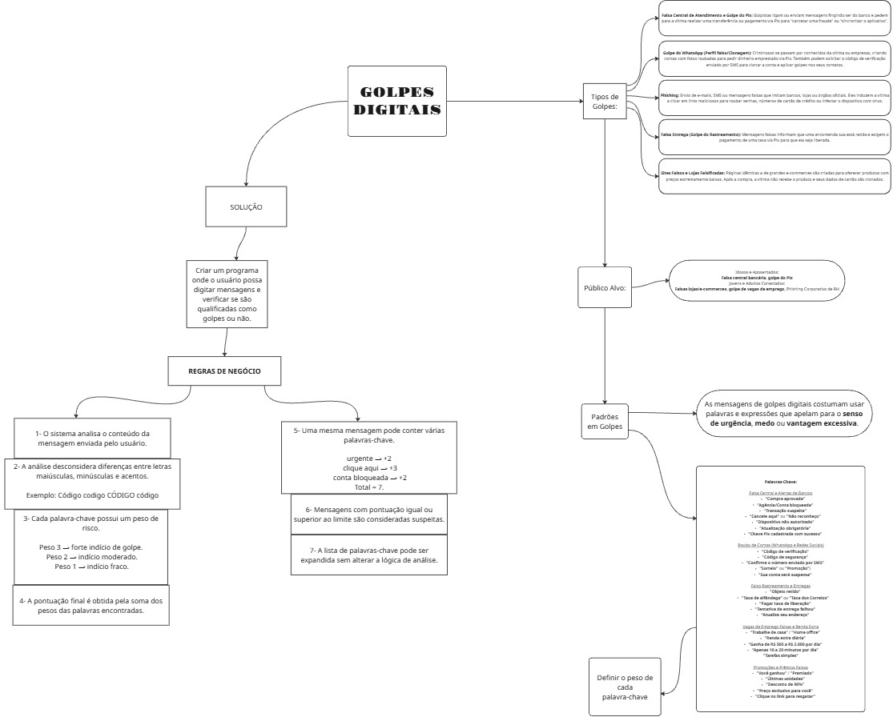

# Chanllenge-java — Scammer Detector


> Uma ferramenta de linha de comando em **Java** que analisa mensagens e e-mails suspeitos, identificando **palavras-chave associadas a golpes digitais** (phishing, engenharia social, fraudes via Pix, falsas promoções, etc.) e retornando uma pontuação de risco.

---

## 📑 Índice

- [Sobre o Projeto](#-sobre-o-projeto)
- [Funcionalidades](#-funcionalidades)
- [Tecnologias Utilizadas](#-tecnologias-utilizadas)
- [Como Funciona](#-como-funciona)
- [Apresentação do Projeto](#-apresentação-do-projeto)
- [Guide Questions (Miro)](#-guide-questions-miro)
- [Estrutura do Projeto](#-estrutura-do-projeto)
- [Contato](#-contato)

---

## 📖 Sobre o Projeto

O **Chanllenge-java** nasceu com o objetivo de ajudar usuários a identificar mensagens de texto e e-mails com **indícios de golpe digital** antes que caiam em fraudes. A aplicação recebe um texto colado pelo usuário, normaliza o conteúdo (removendo acentuação e diferenças de caixa) e o compara com um dicionário de palavras e expressões comumente usadas em golpes, atribuindo uma pontuação de risco a cada uma.

Ao final da análise, o sistema informa se a mensagem é **suspeita de golpe** e, opcionalmente, exibe recomendações de segurança para o usuário.

---

## ✨ Funcionalidades

- 🔍 **Analisar mensagens/e-mails**: cole qualquer texto e receba uma análise automática de risco.
- 📊 **Pontuação de risco**: cada palavra-chave encontrada soma pontos de acordo com seu nível de gravidade (`golpe`, `suspeito`, `menor risco`, `apoio`).
- 🚨 **Classificação automática**: com base em um limiar de pontuação, o sistema indica se a mensagem é suspeita ou não.
- 🛡️ **Recomendações de segurança**: dicas práticas exibidas ao final da análise, caso o usuário deseje.
- 🔤 **Normalização de texto**: remove acentos e ignora diferenças entre maiúsculas/minúsculas para melhorar a detecção.

---

## 🧰 Tecnologias Utilizadas

- **[Java](https://www.oracle.com/java/)** (17 ou superior recomendado)
- API `java.util.Scanner` para entrada via terminal
- API `java.text.Normalizer` para tratamento de texto
- Estrutura de dados `HashMap` para o dicionário de palavras-chave

---

## ⚙️ Como Funciona

1. O usuário cola a mensagem/e-mail suspeito no terminal.
2. O texto é normalizado (sem acentos, em minúsculas).
3. O sistema percorre um dicionário de palavras-chave (`PalavrasChave.java`), somando a pontuação de cada termo encontrado.
4. Se a pontuação total atingir o limiar definido (`LIMIAR_SUSPEITO`), a mensagem é classificada como **suspeita de golpe**.
5. O usuário pode optar por visualizar recomendações de segurança.

---

## 🎤 Apresentação do Projeto

Confira abaixo a apresentação (7 slides) com uma visão geral do projeto, seus objetivos, funcionamento e resultados.

📎 **Link da apresentação:** [https://canva.link/l5n92kqmm45jgvu](https://canva.link/l5n92kqmm45jgvu)

📄 **Arquivo local:** `docs/Golpes Digitais - Challenge 2.pdf`

| # | Slide           | Conteúdo |
|---|-----------------|----------|
| 1 | Capa            | Nome do projeto, integrantes e proposta |
| 2 | Guide Questions | Contexto sobre golpes digitais e a motivação do projeto |
| 3 | regras          | Como o Scammer Detector funciona (visão geral técnica) |
| 4 | Demonstração    | Exemplo de execução e resultados obtidos |


---

## 🧠 Guide Questions (Miro)

Durante o desenvolvimento do projeto, utilizamos o **Miro** para organizar as *guide questions* (perguntas norteadoras) que ajudaram a estruturar o problema, a solução e os próximos passos.


🔗 **Link do quadro no Miro:** [https://miro.com/app/board/uXjVH4z2wwk=/?focusWidget=3458764678986210189](https://miro.com/app/board/uXjVH4z2wwk=/?focusWidget=3458764678986210189)



**Principais guide questions discutidas:**

- Qual problema estamos tentando resolver?
- Quem é o público-alvo da solução?
- Quais são os principais indícios de um golpe digital?
- Como medir e comunicar o nível de risco ao usuário?
- Quais melhorias futuras podem tornar a detecção mais precisa?

---

## 📂 Estrutura do Projeto

```
Chanllenge-java/
├── Main.java              # Ponto de entrada da aplicação (interface via terminal)
├── ScammerDetector.java   # Lógica de análise e cálculo de pontuação de risco
├── PalavrasChave.java     # Dicionário de palavras-chave e seus pesos
├── docs/
│   ├── apresentacao-scammer-detector.pptx   # Apresentação do projeto (5 slides)
│   └── miro-guide-questions.png             # Print do quadro Miro com as guide questions
└── README.md              # Documentação do projeto
```

---

## 📬 Contato

Desenvolvido por **André  Pazini e Assis Pires Neto**

- GitHub: [@PaziniHoch](https://github.com/pazinihoch)
- E-mail: pazinihoch@gmail.com
- LinkedIn: [seu-perfil](https://linkedin.com/in/seu-perfil)

- GitHub: [@Assis](https://github.com/lancelot)
- E-mail: assis.pires.netors@gmail.com
- LinkedIn: [Assis pires Neto](https://linkedin.com/in/assispiresneto)

---

<p align="center">Feito com ☕ e Java para tornar a internet um pouco mais segura.</p>
